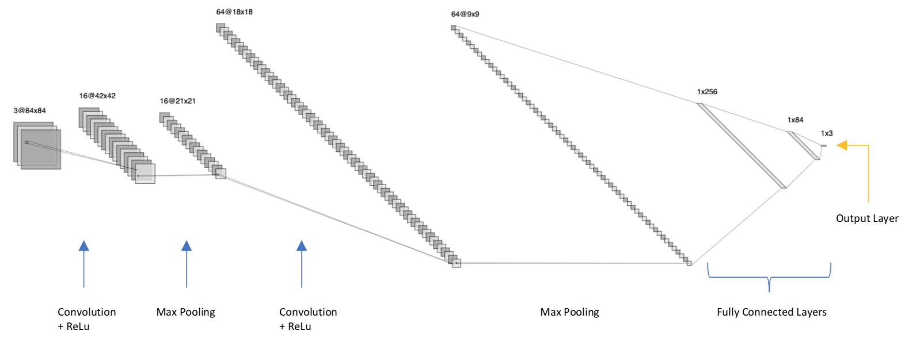

# CNN Model for Classification

I used PyTorch to train a CNN model to classify images of three insects (beetles, cockroaches and dragonflies).

The structure of the model is as follow:
- input size: (3 x 84, 84); 
- conv1: Conv2d(3, 16, kernel_size=(5, 5), stride=(2, 2), padding=(1, 1)); 
- max_pool2d(2); 
- conv2: Conv2d(16, 64, kernel_size=(3, 3), stride=(1, 1)); 
- max_pool2d(2); 
- fc1: Linear(in_features=5184, out_features=256, bias=True);
- fc2: Linear(in_features=256, out_features=84, bias=True);
- fc3: Linear(in_features=84, out_features=3, bias=True).

Data Source: https://www.insectimages.org/index.cfm. 
